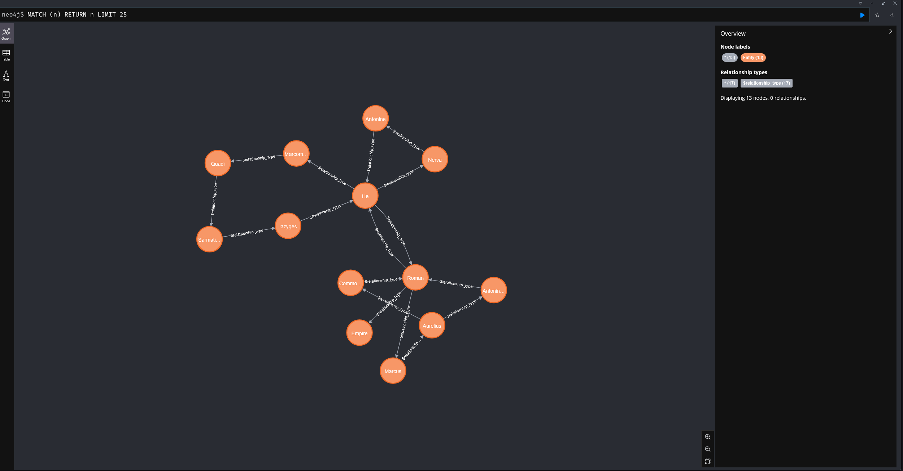
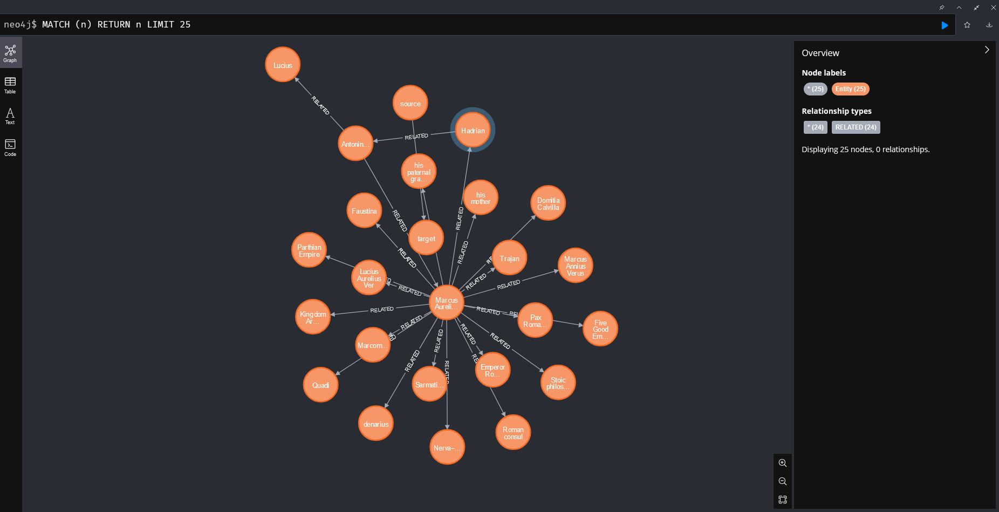
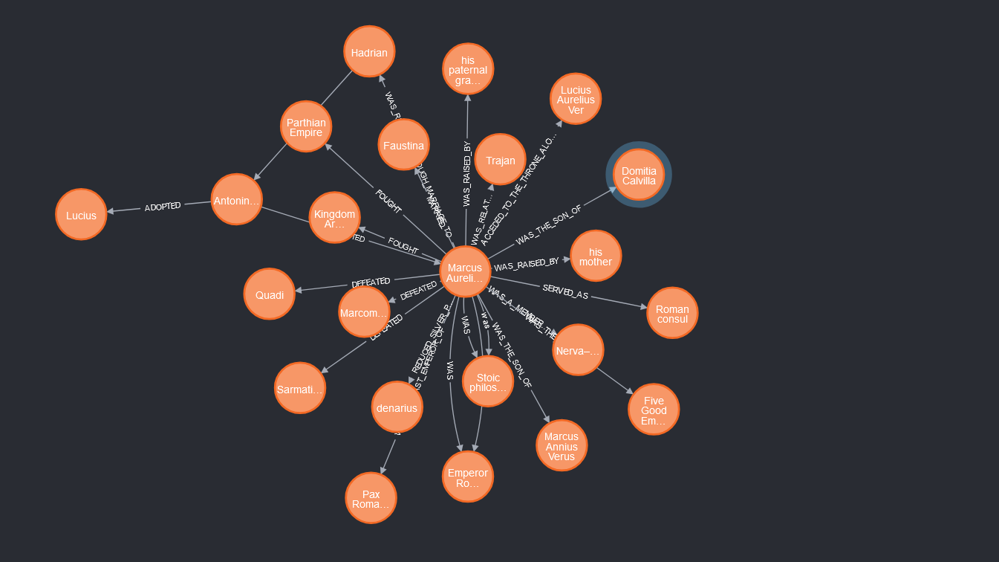
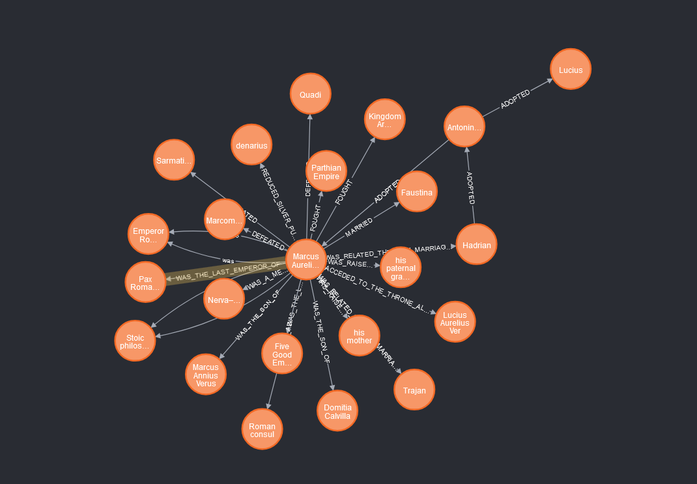
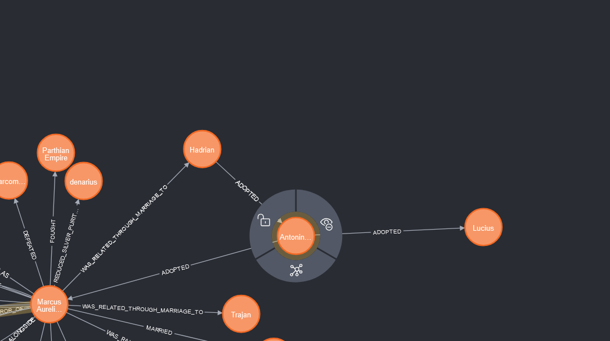
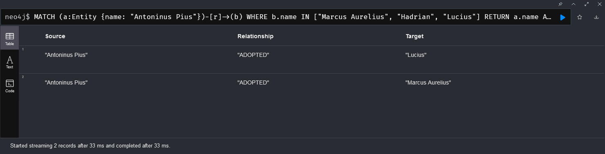

# Galatasaray University Advanced Topics in Computer Engineering Homework 3

## Homework Description
In this homework, we are tasked with creating a knowledge graph from a wikipedia page using langchain and neo4j. The wikipedia page that we are going to use is the Marcus Aurelius page. The knowledge graph that we are going to create will have the following structure:

- Marcus Aurelius
  - Name
  - Last Emperor
  - Related
  - Death Date
  - Spouse
  - Children
  - Parents
  - Enemies
  - Succession

## Requirements
- Python 3.12
- Docker
- Docker Compose

## Installation
1. Clone the repository
```bash
git clone https://github.com/theFellandes/Hw3-Knowledge-Graph
```
2. Change the directory to the repository
```bash
cd Hw3-Knowledge-Graph
```
3. Run the following command to start the neo4j database
```bash
docker-compose up -d
```
4. Install the required python packages
```bash
pip install -r requirements.txt
```

## Usage
To create the knowledge graph, run the following command:
```bash
python main.py
```
To observe the knowledge graph generated by script, open your browser and go to `http://localhost:7474/`. The default username is `neo4j` and the password is `your_password`.

## Project Structure
``bart_main.py`` - The main script that uses BART llm to create the knowledge graph from the wikipedia page.

``main.py`` - The main script that uses langchain to create the knowledge graph from the wikipedia page.

``requirements.txt`` - The file that contains the required python packages.

``Dockerfile`` - The file that contains the docker configuration for the neo4j database.

``docker-compose.yml`` - The file that contains the docker compose configuration for the neo4j database.

``.env`` - The file that contains the environment variables for the docker compose.

``.gitignore`` - The file that contains the files and directories that are ignored by git.

``README.md`` - The file that contains the information about the project.

`db/neo4j/neo4j_connector.py` - The module that contains the functions to interact with the neo4j database.

`legacy` - The directory that contains the trial and error scripts.

`internal` - The directory that contains the internal modules of the project.

``internal/langchain`` - The directory that contains the langchain module.

``internal/langchain/knowledge_graph_builder.py`` - The module that contains the functions to interact with the neo4j.

``internal/langchain/wikipedia_api.py`` - The module that interacts with the Wikipedia api in order to obtain data.

``internal/llm/llm.py`` - The base class for the llms.

``internal/llm/bart.py`` - The class for interacting bart llm.

``internal/reader/yaml_reader.py`` - The utility class for reading yaml files.

## Results

Using Bart for the knowledge graph creation, the following results are obtained:

Bart isn't good at extracting structured data from the wikipedia page. It is better at generating text rather than extracting structured data. The knowledge graph that is generated by Bart is not as good as the one generated by OpenAI.

For Bart, the used task as follows: summarization

Generated Knowledge Graph Using Bart:


After using OpenAI gpt-4o for the knowledge graph creation, the following results are obtained:

OpenAI gpt-4o is better at extracting structured data from the wikipedia page. It is better at generating structured data rather than generating text. The knowledge graph that is generated by OpenAI is better than the one generated by Bart.

Generated Knowledge Graph Using OpenAI version 1:


Generated Knowledge Graph Using OpenAI version 2:
In this version of the knowledge graph, the knowledge graph is generated using the same method as the previous version. The only difference is the named relationships.


Generated Knowledge Graph Using OpenAI version 3:
In this version of the knowledge graph, this version added underscores to the named relationships.



An Interesting Relationship Observed In This Graph:

name: Antoninus Pius adopted Marcus Aurelius and Lucius but was adopted by Hadrian although not in the graph as Emperor, was indeed an emperor to the Roman empire.

Script:

````neo4j
MATCH (a:Entity {name: "Antoninus Pius"})-[r]->(b)
WHERE b.name IN ["Marcus Aurelius", "Hadrian", "Lucius"]
RETURN a.name AS Source, type(r) AS Relationship, b.name AS Target
````





## Used Prompts In OpenAI

Current Result Prompt:

            Analyze the following text and extract entities and relationships in CSV format.
            The CSV should have the following columns: 'source', 'relationship', 'target'.

            Text: {chunk.page_content}

            Example output:
            source,relationship,target
            Marcus Aurelius,wrote,Meditations
            Marcus Aurelius,was born in,Rome

            Your output should be a CSV with the columns 'source', 'relationship', and 'target'.

Previous Version With JSON:

            Analyze the following text and extract entities and relationships in JSON format.
            Please return only valid JSON data, and make sure the keys are 'source', 'relationship', and 'target'.
            Each relationship should be a dictionary with these three keys.

            Text: {chunk.page_content}

            Example output:
            [
                {{
                    "source": "Marcus Aurelius",
                    "relationship": "wrote",
                    "target": "Meditations"
                }},
                {{
                    "source": "Marcus Aurelius",
                    "relationship": "was born in",
                    "target": "Rome"
                }}
            ]

            Your output should be a list of relationships in JSON format, and nothing else.


## Authors
- [Oğuzhan Güngör](https://github.com/theFellandes/)
